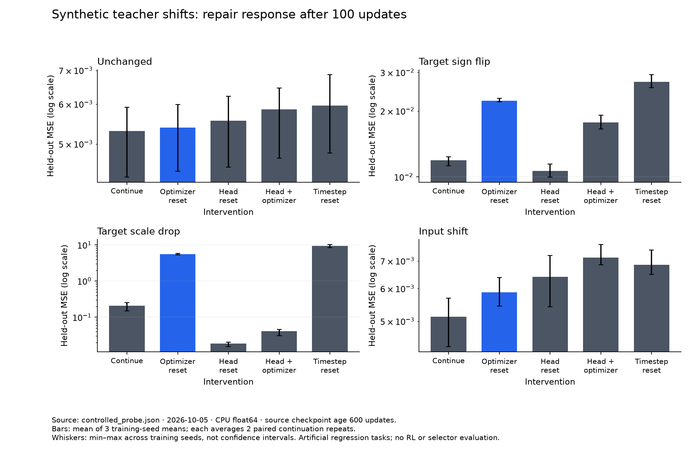

# Выполненный синтетический контроль: 5 октября 2026

**Что уже есть:** воспроизводимый CPU-runner для независимых копий checkpoint и явно заданных ремонтов; 24 checkpoint, 288 continuation branches, шесть проверок корректности. Это supervised regression на искусственной teacher-задаче. RL return, падение plasticity в естественном RL и перенос selector здесь не проверялись.

## Постановка

Модель: ReLU MLP `8→32→32→1`; frozen tanh teacher. Три seed определяют initialization и datasets. Возрасты checkpoint — 100 и 600 source updates; два paired continuation repeats; каждой ветке даётся 100 updates с batch size 64. Source, future training и held-out datasets содержат по 512 примеров. Adam: LR=0.001, betas=(0.9,0.999), epsilon=1e-8, weight decay=0. CPU, float64, один thread.

Четыре сценария:

- `unchanged`: teacher и input distribution прежние, training examples новые;
- `target_sign_flip`: новый teacher равен минус старому;
- `target_scale_drop`: source targets равны `30×teacher`, future targets равны `teacher`;
- `input_shift`: teacher прежний, future inputs сдвинуты на +1.5 по каждой координате.

Внутри checkpoint/repeat все действия получают одинаковые inputs, targets и порядок minibatches. Training loss измеряет fitting; held-out MSE отдельно измеряет generalization к той же frozen teacher-функции. Это разные outcomes.

Меню: strict continue; full optimizer reset (`m,v,t`); head reset к **собственной исходной initialization** при сохранении encoder и optimizer; тот же head reset + full optimizer reset; timestep-only reset; эквивалентный ему LR/epsilon schedule без reset состояния. Последние два arms — проверка механизма, не два независимых решения.

## Что получилось

Для checkpoint возраста 600 в `target_scale_drop` средняя held-out MSE после 100 updates:

- continue: **0.207**;
- optimizer reset: **5.580**;
- head reset: **0.0184**;
- head + optimizer reset: **0.0409**;
- timestep reset: **9.343**.

У более раннего checkpoint, возраста 100, в том же сценарии средние значения равны 0.983, 0.127, 0.356 и 0.0186 для первых четырёх действий соответственно. Совместный reset здесь лучший по среднему; у позднего checkpoint лучший head-only reset. Это наглядная зависимость response от training history. Сценарий и LR сконструированы для контроля; вывод о естественной RL-деградации из него не следует.

В `unchanged` на возрасте 600 continue даёт 0.00531, optimizer reset — 0.00539: разница мала относительно разброса training seeds. В `target_sign_flip` head reset даёт 0.0107 против 0.0119 у continue; это exploratory difference, не установленный статистически эффект.



Столбцы — среднее по трём training-seed means, каждый усредняет два continuation repeats. Усы — min–max между этими seed means, **не confidence intervals**. У каждой панели собственная логарифмическая шкала; высоту столбцов между панелями сравнивать нельзя.

Во всех 48 paired comparisons timestep reset и его LR/epsilon control совпали по конечной held-out MSE с максимальной абсолютной разницей **2.22×10⁻¹⁶**. Отдельный test проверяет многократные updates при большем epsilon. [Алгебра и условия эквивалентности](adam_reset_controls.md).

По средним двух repeats empirical winners среди пяти уникальных действий: continue — 7 checkpoint, optimizer reset — 4, head reset — 9, joint reset — 4. Это descriptive counts с winner-selection bias; они не оценивают population oracle и не доказывают необходимость selector. Возрасты и сценарии используют связанные training histories: **288 branches не равны 288 независимым наблюдениям**.

## Что проверено в реализации

Шесть tests: независимость weights/moment storage между клонами; сохранение outputs при optimizer-only reset; сохранение Parameter identities и optimizer bindings при head reset; совпадение continue traces на одинаковых batches; full optimizer reset совпадает с fresh Adam; timestep reset совпадает с выведенным schedule при сохранённых moments и ином clock. Независимое чтение runner/tests не выявило блокирующих ошибок.

Run завершился без nonfinite branches за **36.22 секунды**. Python 3.13.12, PyTorch 2.12.1+cu126; GPU не использовалась. Runtime — наблюдение на этой машине, не benchmark.

## Воспроизведение и данные

Из корня репозитория:

```powershell
python -m unittest discover -s tests -v
python experiments/controlled_probe.py
python scripts/summarize_controlled_probe.py
```

[Runner](../experiments/controlled_probe.py), [tests](../tests/test_controlled_probe.py), [raw results](../research/results/controlled_probe.json), [descriptive summary](../research/results/controlled_probe_summary.json), [plot script](../scripts/summarize_controlled_probe.py). SHA-256 runner во время запуска: `71706026ff6e2b7dc857a4656682ad52ac758920a8df49fb71e82388cd7e7d9b`.

## Ограничения и следующий вопрос

Diagnostics видят labels **future training task** до выбора действия; held-out labels в diagnostics не входят. Такая teacher-информация обычно недоступна в live RL. Ни learned selector, ни grouped unseen-environment split ещё не запускались. LR один и не tuned отдельно для каждого метода; никакого ranking Adam/AdamRel algorithms здесь нет. Reset к исходному head — наша operational choice, а не точная репликация fresh-head reset из каждой статьи.

Контроль оправдывает следующий шаг: тот же fork runner с фиксированными transitions и frozen TD targets, затем маленький online RL-пилот. Сначала проверить независимые continuation repeats и устойчивую неоднородность effects; не обучать classifier «четырёх причин» на этих четырёх искусственных сценариях. [Полный протокол](experimental_protocol.md).
